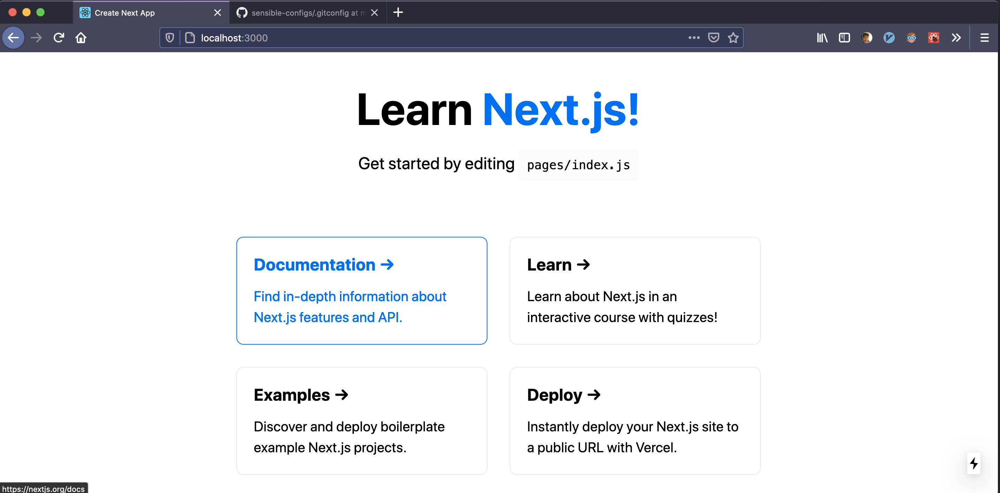

# 100 Days Of Code - Log

### Day 2

**Today's Progress**

- It's CSS!! Worked on Lesson No. 2 of Next.js learning track, Dealing with _**Assets, MetaData and CSS**_;
- Read through some of the JavaScript Prerequisite by KCD, as part of his epicreact.dev

**Thoughts**

- A Slow and sedate start to coding phase of the day I'd say
- CSS (in JS!) is a topic I love. Had fun revisiting few concepts like css modules
- Looking forward to explore more with Tailwind CSS in the upcoming days
- Happy to have a streak! :p
- Planning to sort of go through full lessons first and take up the tasks unguided tmrw. Let's see
- Also will be side by side taking a refresher on React and other web tooling surrounding it; with the help of EpicReact Dev workshop by Kent C. Dodds

### Day 1

**Today's Progress**

- Started with [Learning track](https://nextjs.org/learn/basics/create-nextjs-app) of Next.js & Completed with first 2 tasks
- Spent some quality time with docs of following section in Next.js site
  - [Intro to Routing](https://nextjs.org/docs/routing/introduction)
  - [Dynamic Routing](https://nextjs.org/docs/routing/dynamic-routes)
  - Static Generation

**Thoughts**

- The idea is to understand next.js 's inner workings while simultaneously trying to build a minimal personal website.
- Felt good about starting this, let's see how I do in coming days
- The initial tasks seems fairly easy, I'm guessing they'd become trickier as well progress to more advanced concepts
- That is why I'm also considering reviving one of my abandoned projects, Sudoku grid and see if I can work on it in between these ones so that I don't get too much bored/tired.

**Work showcase / Progress**

Trying to achieve something like: [this](https://next-learn-starter.now.sh/).
Day one so far

